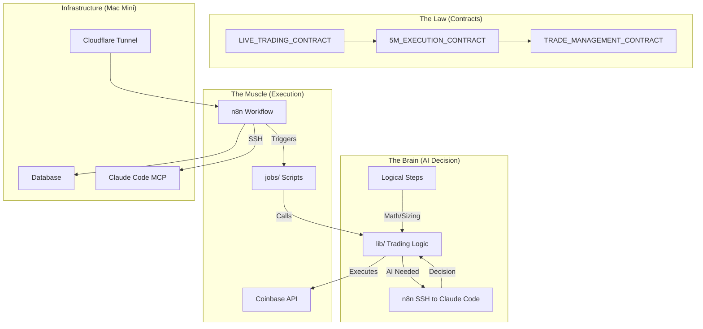

# Implementation Plan - Live Automated Trading Setup

This plan outlines how to execute your code live using the `@contract/` rules and `@logicalSteps/` via n8n on your Mac mini.

## Goal
Establish a robust, automated trading execution environment on the Mac mini that strictly adheres to the "Signed Contracts".

## Architecture Overview
The system follows a strict hierarchy where **Contracts** define the rules, **Logical Steps** provide the math, and **n8n** handles the execution.

## User Review Required
> [!IMPORTANT]
> **24/7 Operation**: Your Mac mini MUST remain on and connected to the internet 24/7 for n8n to execute trades and monitor positions.

> [!WARNING]
> **Strict Adherence**: The `jobs/` scripts must blindly follow the `lib/` logic which should implement the Contracts. Any manual intervention (unless Emergency) violates the Contract.

## Proposed Setup Steps

### 1. Infrastructure Preparation (Mac Mini)
- **Node.js**: Ensure Node.js 20 LTS is installed.
- **PostgreSQL**: Ensure Database is running (`brew services start postgresql@16`).
- **Claude Code**: Accessible via SSH for AI decisions (using n8n SSH node).
- **n8n**: Install and start n8n (`npm install -g n8n`, `n8n start` or Docker).
- **Cloudflare**: (Optional for remote access, but good for webhooks)
  - `cloudflared tunnel --url http://localhost:5678`

### 2. Workflow Orchestration (n8n)
We will create n8n workflows to trigger the `jobs/` scripts on the schedules defined in `DAILY_OPERATING_CHECKLIST.md`.

#### Workflow 1: Data Collection (Every 4H)
- **Trigger**: Cron (Every 4 hours)
- **Action**: Execute `node jobs/collect_4h.js`
- **Action**: Execute `node jobs/scan_4h.js`

#### Workflow 2: Execution Loop (Every 5M)
- **Trigger**: Cron (Every 5 minutes)
- **Action**: Execute `node jobs/collect_5m.js`
- **Action**: Execute `node jobs/scan_5m.js`
- **If Confluence COMPLETE**:
  - **SSH Node**: Connect to Claude Code
  - **Send**: Trade context (4H sweep, 5M patterns, logical steps)
  - **Receive**: AI decision (YES/NO, entry, stop, target)
  - **Execute**: If YES, trigger trade execution via `lib/trading/executor.js`

#### Workflow 3: Position Monitor (Every 1M)
- **Trigger**: Cron (Every minute)
- **Action**: Execute `node jobs/track_swings.js` (Updates trailing stops, P&L)

### 3. Verification Plan
To know the bot is working:
- **Dashboard**: Run `npm run dev` in `dashboard/` and view `localhost:3000`.
- **Logs**: Check `logs/` directory (e.g., `logs/trading.log`).
- **n8n UI**: Visual indication of workflow success/failure.
- **Claude Code Logs**: Check SSH node output for AI decision logs.

## Implementation Tasks
#### [MODIFY] [jobs/scan_5m.js](file:///Users/ble/TradingBot/jobs/scan_5m.js)
- Complete the TODO on line 67 to trigger AI decision via n8n webhook or direct call.

#### [NEW] [lib/ai/claude_decision.js](file:///Users/ble/TradingBot/lib/ai/claude_decision.js)
- Create AI decision handler that formats trade context and parses Claude Code response.

#### [NEW] [workflows/main_trading_workflow.json](file:///Users/ble/TradingBot/workflows/main_trading_workflow.json)
- Create a reusable n8n workflow JSON file with SSH node for Claude Code integration.

#### [NEW] [scripts/verify_environment.js](file:///Users/ble/TradingBot/scripts/verify_environment.js)
- A script to check if DB, Claude Code SSH, and Coinbase API are reachable.
